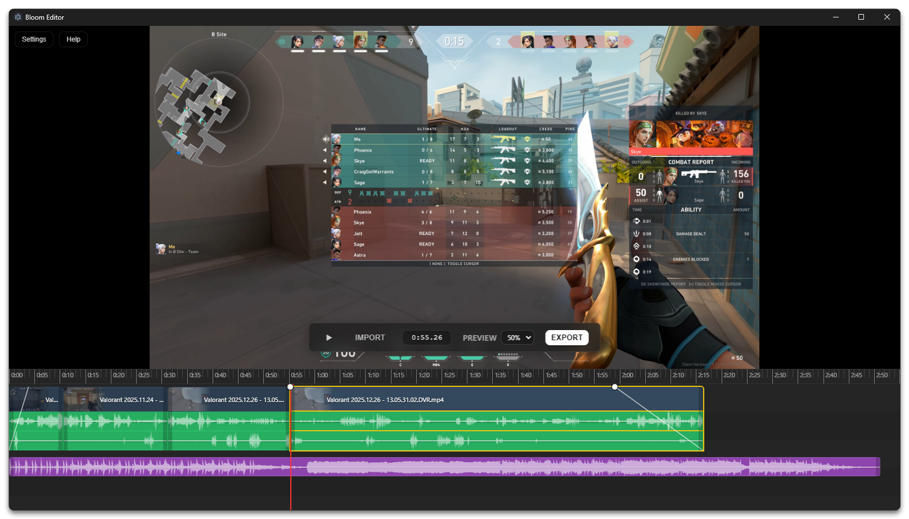

# Bloom Editor

Bloom Editor (name TBD) is a clip editing software built with Electron that allows the user to quickly cut and merge clips for uploading to social media (Twitter, Youtube, and Discord primarily).


[](https://github.com/125hz/bloom-clip-editor/releases/latest)

## Features
- **Efficient Editing:** Easily split and delete clips with shortcuts (view all shortcuts in the "Help" menu).
- **Multiple Clip Support:** Allows you to combine multiple clips together.
- **Multi-track Audio Support:** Supports clips with multiple audio tracks (great for Shadowplay clips with separate mic audio layer)!
- **Presets for Exporting**: Multiple presets including Discord preset (keeps file size under 10mb)!

## Install
Download the latest [Windows release (.exe)](https://github.com/125hz/bloom-clip-editor/releases/latest/download/bloom-editor-Windows-Installer-x64.exe)

## Manual Install & Running

### 0. Requirements
Install Node.js: https://nodejs.org/

### 1. Clone the Repository
```bash
git clone https://github.com/125hz/bloom-clip-editor.git
cd bloom-clip-editor
```
### 2. Install Dependencies
This will install Electron and the necessary video processing libraries:
```bash
npm install
```
### 3. Run the App
```bash
npm start
```