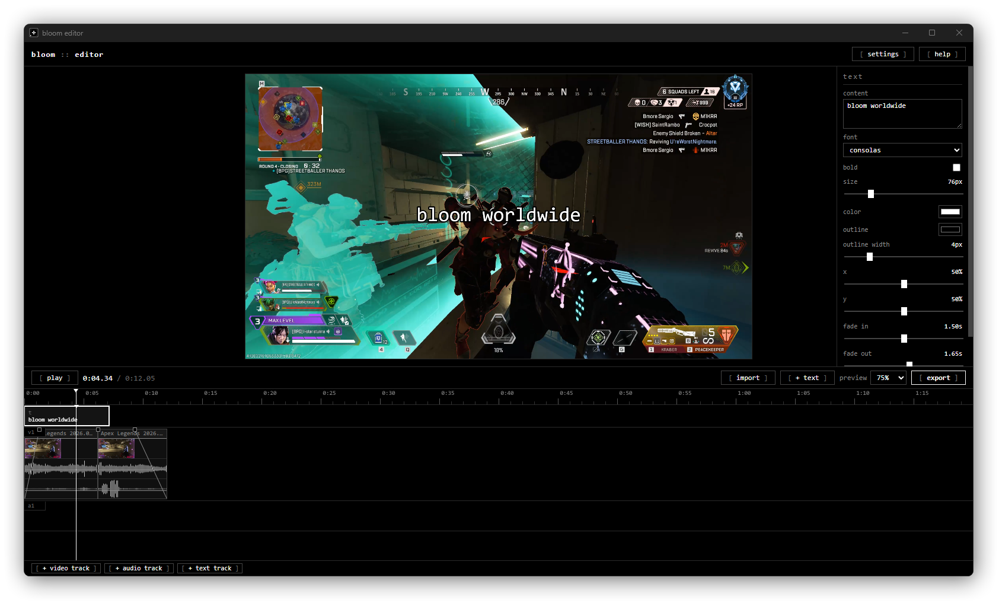

# Bloom Editor

Bloom Editor is a clip editing software built with **Tauri** (Rust + WebView2) that lets you quickly cut, layer, and merge clips for uploading to social media (Twitter, YouTube, and Discord primarily). Compared to the old Electron build it starts faster, uses a fraction of the memory, and the installer is dramatically smaller.



## Features
- **Efficient Editing:** Split, trim, and delete clips with keyboard shortcuts.
- **Layer System:** Multiple video/audio/text tracks — drag clips between layers.
- **Text Overlays:** Add styled text (font, size, color, outline, position) that renders into the final export.
- **Multi-track Audio Support:** Clips with multiple audio tracks (great for Shadowplay clips with a separate mic layer).
- **Smooth Playback:** Sample-accurate audio scheduling and preloaded video — no stutter at clip boundaries.
- **Presets for Exporting:** Single-pass ffmpeg export, including a Discord preset that keeps files under 10 MB.

## Install
Download the latest [Windows release (.exe)](https://github.com/125hz/bloom-clip-editor/releases/latest/download/bloom-editor-Windows-Installer-x64.exe)

## Manual Install & Running

### 0. Requirements
- Node.js: https://nodejs.org/
- Rust (for building the Tauri backend): https://rustup.rs/

### 1. Clone the Repository
```bash
git clone https://github.com/125hz/bloom-clip-editor.git
cd bloom-clip-editor
```
### 2. Install Dependencies
This installs the Tauri CLI and the bundled ffmpeg/ffprobe binaries:
```bash
npm install
```
### 3. Run the App (dev)
```bash
npm run dev
```
### 4. Build the Installer
```bash
npm run build
```
The NSIS installer is written to `src-tauri/target/release/bundle/nsis/`.
